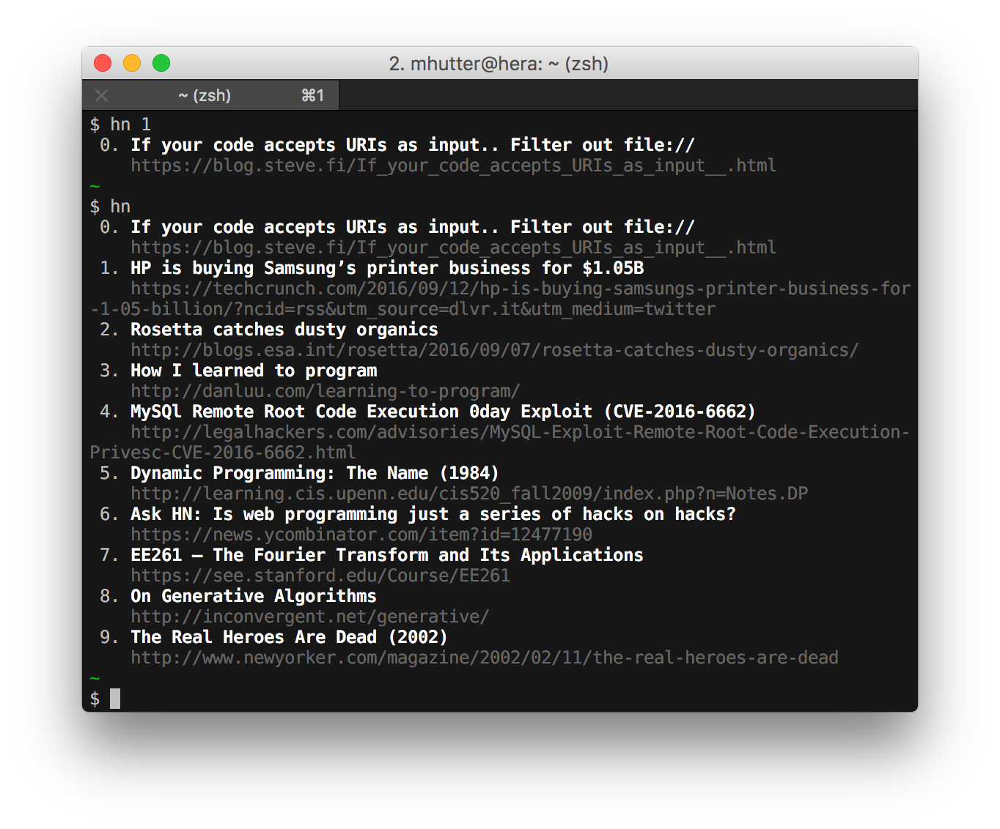

# hn-cli

Minimal Hacker News CLI.

## Installation

    go get -u github.com/mhutter/hn-cli/hn

## Usage

    hn [<number of stories>] [<offset>]

- **number of stories** defaults to `10`
- **offset** defaults to `0`

## Examples

## TODO

- [ ] local caching
